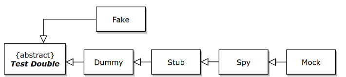

## 💡테스트 더블과 모의 객체

- 스텁, 페이크, 모의 객체를 사용해서 테스트를 단순화 하는 방법
- 모의 객체가 무엇인지, 모의 객체를 언제 사용해야 하는지, 언제 사용하지 말아야 하는지에 대한 이해
- 모의할 수 없는 객체를 모의 하는 방법

 자동화된 테스트를 작성할 경우에 테스트들이 의존성을 가지고 같이 실행되어야 하는 경우가 많은데 이번 장에서는 종속성을 너무 신경 쓰지 말고 격리된 방시으로 테스트하는 데 초점을 맞춘다.

 **이러한 테스트를 하는이유**
 - 테스트 대상 클래스를 구체적인 의존성과 함께 수행하는 일은 너무 느리거나, 힘들거나, 많은 일을 해야할 수 있음.
 - 예를들어 데이터베이스를 의존하는 테스트의 경우에는 데이터베이스 테스트를 설정하고 올바른 데이터가 포함되었는지 준비를 해야한다. 이로 인해 의존성이 없는 테스트에 비해 훨씬 더 많은 작업을 필요로한다. 그래서 다른 클래스에 의존하는 클래스를 테스트할 때 의존성을 사용하지 않는 방법을 알아내야한다. 이때 테스트 더블(Test double)이 도움이 된다.

**다른 객체의 동작을 시뮬레이션 하는 객체를 사용하면 좋은 장점** 
- 더큰 제어권을 가진다.
- 시뮬레이션은 빠르다.
- 개발자가 모의 객체를 설계 기법으로 사용하여 클래스 간의 상호작용을 반영할 수 있음.
  


<br>

## 💡더미, 페이크, 스텁, 모의객체, 스파이
  

### 더미
- 더미는 테스트 대상 클래스에 전달되지만 절대 사용되지 않는 객체다.
- 어떤 비즈니스 애플리케이션에 전달해야 할 인수가 여러개 있지만 테스트는 이들 중 몇 개만 수행할 때 흔히 볼 수 있다.
- 예를들어 Customer 클래스에 대한 단위 테스트에서 이 클래스는 Address, Email 같은 여러 다른 클래스에 의존할 것이다. 테스트 케이스 A가 어떤 동작을 수행하고자 하고, 이동작은 Customer가 어떤 Address를 가지든지 상관없다 이럴경우 더미 Address 객체를 설정해서 Customer에 넘길 수 있다.
<br>

### 페이크 객체
- 페이크 객체는 시뮬레이션 하려는 클래스 같이 실제로 동작하는 구현체를 가진다. 하지만 똑같이 동작하는건 아니고 훨씬 단순한 방법으로 동작한다.
- 예를들어 데이터 베이스 대신 배열 목록을 사용하는 페이크 데이터 베이스가 있는데 실제 데이터베이스보다 더 다루기 쉽다.

<br>

### 스텁
- 테스트 과정에서 수행된 호출에 대해 하드 코딩된 응답을 제공한다.
- 페이크 객체와는 달리 스텁은 실제로 동작하는 구현체가 없고 스텁화된 메서드인 getAllInvoices를 호출하면 스텁은 하드 코딩된 코딩된 송장 목록을 반환한다.
- 스텁은 가장 인기 있는 시뮬레이션 유형이고 대부분 경우 테스트 대상 메서드가 실행을 계속할 수 있도록 종속성 클래스는 어떤 값을 반환해야 한다. getAllInvoices 메서드에 의존하는 메서드를 테스트 하는 경우 스텁을 사용하여 빈목록, 한요소가 포함된 목록, 여러요소가 포함된 목록등을 반환하도록 할 수 있다.<br>
-> 이를 통해 데이터베이스가 반환하는 다양한 길이의 목록에 대해 테스트 대상 메서드가 어떻게 동작하는지 확인 할 수 있다.

<br>

### 모의 객체
- 모의 객체는 메서드의 응답을 설정할 수 있다는 점에서 스텁 같은 역할을 한다.
- 예를 들어 getAllInvoices가 호출될 때 송장 목록을 반환하도록 할 수 있다. 하지만 모의 객체는 그이상이다.<br>
모의 객체는 모든 상호작용을 저장해서 나중에 단언문에 활용할 수 있도록 해준다. getAllInvoices 메서드가 한 번만 호출되길 바랄 수 있다.<br>
만약 테스트 대상 메서드가 이를 두번 호출하면 이는 곧 버그가 있다는 뜻이고 테스트는 실패한다. 테스트 마지막에 'getAllInvoices 메서드가 한번만 호출됐다.' 라는 단언문을 작성할 수 잇다.

<br>

### 스파이
- 의존성을 감시한다. 스파이는 실제 객체를 감싸서 그 행동을 관찰한다. 엄밀히 말해 우리는 객체를 시뮬레이션하는게 아니라 감시하고 있는 근본 객체와 모든 상호작용을 기록한다.
- 스파이는 특정 맥락에서 사용된다. 모의객체를 사용하는 것보다 실제로 구현하는게 훨씬 더 쉽고, 테스트 대상 메서드가 의존 대상과 어떻게 상호작용하는지 단언하고자 하는 경우에 사용된다. 
- 스파이는 현업에서는 보기 힘들다.
<br> <br>

## 💡모의 객체 프레임워크에 대한 소개
모키토
- mock(<class>) : 주어진 클래스로 모의 객체 또는 스텁을 생성한다. 클래스는 <ClassName>, class로 구체화 한다.
- when(<mock>.<method>).thenbReturn(<value>) : (스텁화된) 메서드의 동작을 정의하는 연속된 메서드 호출이다. <value>를 반환한다.
<br> 예를들어 issuedInvoice의 all 메서드가 송장목록을 반환하도록 모의하려면 when(issuedInvoices.all()).thenReturn(someListHere)과 같이 작성하면 된다.
- verify(<mock>).<method> : 모의 객체와 상호작용이 예상된 방식대로 일어난다고 단언한다.<br> 예를들어 issuedInvoices의 all() 메서드가 호출되었는지 확인하고 싶은 경우 **verify(issuedInvoices).all()** 을사용한다.


### 의존성 스텁화
```java
import java.util.List;

import static java.util.stream.Collectors.toList;
//InvoiceFilter 클래스
public class InvoiceFilterWithDatabase {

    public List<Invoice> lowValueInvoices() {
        DatabaseConnection connection = new DatabaseConnection(); //종속성 클래스 IssuedInvoices 인스턴스를 생성한다. 
        IssuedInvoices issuedInvoices = new IssuedInvoices(connection); // DatabaseConnection 객체가 필요하므로 함께 생성한다.

        try {
            List<Invoice> all = issuedInvoices.all(); //데이터베이스로부터 모든 송장을 얻는다.

            return all.stream()
                    .filter(invoice -> invoice.getValue() < 100)
                    .collect(toList()); //값이 100보다 작은것을 고른다.
        } finally {
            connection.close(); //데이터베이스 연결을 닫는다.
        }
    }
}
```


```java
import org.junit.jupiter.api.AfterEach;
import org.junit.jupiter.api.BeforeEach;
import org.junit.jupiter.api.Test;

import static org.assertj.core.api.Assertions.assertThat;
//InvoiceFilter 클래스에 대한 테스트
public class InvoiceFilterWithDatabaseTest {
    private IssuedInvoices invoices;
    private DatabaseConnection dbConnection;

    @BeforeEach //BeforEach 메서드는 테스트가 수행되기 전에 매번 실행된다.
    public void open() {
        dbConnection = new DatabaseConnection();
        invoices = new IssuedInvoices(dbConnection);

        dbConnection.resetDatabase(); //DB에 있는 이전 데이터를 지워서 테스트에 방해 되지 않도록 한다.
    }

    @AfterEach //AfterEach 메서드는 테스트가 수행된 후에 매번 실행된다.
    public void close() {
        if (dbConnection != null) dbConnection.close(); //각 테스트를 수행한 다음 DB 연결을 닫는다.
    }

    @Test
    void filterInvoices() {
        final var mauricio = new Invoice("Mauricio", 20); //인메모리 송장 생성
        final var steve = new Invoice("Steve", 99); //경계 테스트
        final var frank = new Invoice("Frank", 100);

        invoices.save(mauricio); //데이터 베이스에 영속화
        invoices.save(steve);
        invoices.save(frank);

        final InvoiceFilterWithDatabase filter = new InvoiceFilterWithDatabase(); //InvoiceFilter를 초기화한다 객체가 DB에 연결될거니까

        assertThat(filter.lowValueInvoices())
                .containsExactlyInAnyOrder(mauricio, steve); //메서드가 작은 값을 가진 송장만 반환한다.
    }
}
```


**문제점**
- 훨씬 더 복잡한 데이터베이스 구조를 가진 비지니스 클래스 일경우 비용이 많이듬.
- 테스트를 하려면 DB설정을 해야한다. (작업량이 많음)
<br><hr> 

**IssuedInvoices 클래스를 스텁으로 만들어 DB와 연결하지 않도록함**

```java
import java.util.List;

import static java.util.stream.Collectors.toList;

public class InvoiceFilter {

    private final IssuedInvoices issuedInvoices; //종속성을 저장할 필드 선언

    public InvoiceFilter(IssuedInvoices issuedInvoices) { //IssuedInvoices 생성자에 전달
        this.issuedInvoices = issuedInvoices;
    }
    public List<Invoice> lowValueInvoices() {
        List<Invoice> all = issuedInvoices.all(); //더 이상 IssuedInvoices DB 인스턴스를 생성안하고 전달받은 종속성을 사용한다.

        return all.stream()
                .filter(invoice -> invoice.getValue() < 100)
                .collect(toList());
    }
}

```


```java
import org.junit.jupiter.api.Test;

import java.util.Arrays;
import java.util.List;

import static org.assertj.core.api.Assertions.assertThat;
import static org.mockito.Mockito.mock;
import static org.mockito.Mockito.when;
//IssuedInvoices 스텁을 이용해서 InvoiceFilter를 테스트 하기
public class InvoiceFilterTest {

    @Test
    void filterInvoices() {
        IssuedInvoices issuedInvoices = mock(IssuedInvoices.class); //모키토의 모의 메서드 를 이용해서 IssuedInvoices 클래스에 대한 스텁 인스턴스 생성

        Invoice mauricio = new Invoice("Mauricio", 20); //송장 생성
        Invoice steve = new Invoice("Steve", 99);
        Invoice frank = new Invoice("Frank", 100);

        List<Invoice> listOfInvoices = Arrays.asList(mauricio, steve, frank); 

        when(issuedInvoices.all()).thenReturn(listOfInvoices); //all()이 호출되면 스텁이 미리 정의된 송장 목록을 반환하도록 한다.

        InvoiceFilter filter = new InvoiceFilter(issuedInvoices); // 테스트 대상 클래스의 인스턴스를 생성하고 종속성으로 스텁을 전달한다.

        assertThat(filter.lowValueInvoices())
                .containsExactlyInAnyOrder(mauricio, steve); // 동작이 기대한 바와 같은지 단언한다.
    }


}
```

**장점**
1. 더이상 DB랑 연결안해도됨
2. 스텁을 완전히 제어할 수 있어 여러 경우 테스트를 빠르게 시도할 수 있다.

### | 정리
>- 스텁은 테스트를 쉽게 작성할 수 있게 해줄 뿐만 아니라 테스트 클래스를 응집력 있게 해준다. 
>- 응집력이 있는 테스트는 다른 이유로 실패할 확률이 적다.
>- 스텁을 사용함으로써, IssuedInvoices의 버그가 아니라 InvoiceFilter에 버그가 있을 때만 실패한다.
>- 이는 테스트가 실패했을 때 디버깅 시간을 아껴준다.
>- 테스트 과정에서 종속성의 비용이 많이 든다면 스텁이 유용할 수 있다.

<br>
<hr>

### 💡모의객체와 기댓값
```java
public interface SAP {
    void send(Invoice invoice); //SAP 통신 캡슐화
}
```

```java
import java.util.List;

public class SAPInvoiceSender {

    private final InvoiceFilter filter; //필요한 의존성을 위한 필드 선언
    private final SAP sap; // ```

    public SAPInvoiceSender(InvoiceFilter filter, SAP sap) { //클래스 생성자는 두 의존성을 필요로 한다.
        this.filter = filter;
        this.sap = sap;
    }

    public void sendLowValuedInvoices() { // 메서드 로직 값이 작은 송장을 InvoiceFilter를 통해 구한다 그리고 각각 SAP 에 전송
        List<Invoice> lowValuedInvoices = filter.lowValueInvoices();
        for(Invoice invoice : lowValuedInvoices) {
             sap.send(invoice);
        }
    }
}
```
- SAPInvoiceSender 클래스를 테스트 해보자. InvoiceFilter를 테스트 하는 것이 목표가 아니기 때문에 이 클래스를 스텁으로 만들어서 테스트 하려는 메서드를 테스트해야 한다. 스텁은 작은 값을 가진 송장 목록을 반환한다. 테스트의 주목적은 작은 값의 송장이 모두 SAP에 전송되는지 확인하는 것이다. SAP에 있는 send() 메서드 호출이 발생했는지 확인하면 된다. <br>
- 모키토는 모의 객체와의 상호작용을 모두 기록한다. SAP 인터페이스를 모의해서 테스트 대상 클래스에 전달하고, 호출되기를 기대하는 메서드가 호출되었는지 확인하기 위해 verify 단언문을 확인한다. 현재 테스트 메서드의 경우, send 메서드가 mauricio와 frank 송장에 대해 둘 다 호출되기를 기대한다.

```java
import org.junit.jupiter.api.Test;

import java.util.Arrays;
import java.util.List;

import static java.util.Collections.emptyList;
import static org.mockito.ArgumentMatchers.any;
import static org.mockito.Mockito.*;

public class SAPInvoiceSenderTest {

    private InvoiceFilter filter = mock(InvoiceFilter.class);
    private SAP sap = mock(SAP.class);
    private SAPInvoiceSender sender = new SAPInvoiceSender(filter, sap); // 모의 객체와 스텁을 테스트 대상 클래스에 전달한다.

    @Test
    void sendToSap() {
        Invoice mauricio = new Invoice("Mauricio", 20);
        Invoice frank = new Invoice("Frank", 99);

        List<Invoice> invoices = Arrays.asList(mauricio, frank);

        
        when(filter.lowValueInvoices()).thenReturn(invoices); //InvoiceFilter 스텁 설정. lowValueInvoices()가 호출될 때 마다 두 개의 송장 반환

        sender.sendLowValuedInvoices(); // 테스트 대상 메서드 호출. 두 개의 송장이 SAP으로 전달될 것을 알고 있음.

        verify(sap).send(mauricio); //send 메서드가 두 송장에 대해 호출되었는지 확인.
        verify(sap).send(frank);
    }
}
```
**|모키토 veerify 실패 시 메세지**
sender.sendLowValuedInvoices(); 코드를 주석할 경우<br>
```java
Wanted but not invoked:
sap.send( // send가 호출되지 않음
	Invoice{customer='Mauricio', value=20}
)

Actually, there were zero interactions with this mock.

```
**스텁과 목킹의 차이점**
- 스텁은 어떤 메서드 호출에 대해 하드코딩한 값을 반환하고,<br> 모킹은 훨씬더 구체적인 기댓값을 정의 할 수 있게 해준다
<hr>

**모키토 기댓값 예시**

```java
// 어떤 송장에 대해 send 메서드가 정확히 두 번 호출되었음을 검증
verify(sap, times(2)).send(any(Invoice.class));

// mauricio 송장에 대해 send 메서드가 한 번 호출되었음을 검증
verify(sap, times(1)).send(mauricio);

// frank 송장에 대해 send 메서드가 한 번 호출되었음을 검증
verify(sap, times(1)).send(frank);
```

**작은 값을 가진 송장이 없는 경우**
```java
    @Test
    void noLowValueInvoices() {
        List<Invoice> invoices = emptyList();
        when(filter.lowValueInvoices()).thenReturn(invoices);// 스텁이 빈 목록을 반환하도록 함.

        sender.sendLowValuedInvoices();

        verify(sap, never()).send(any(Invoice.class));// 어떤 송장에 대해서도 send() 메서드가 호출 되지않았음을 확인
    }

```


### 💡인수포획
> 요구사항 변경
>- SAP는 invoice엔티티를 직접 받는 대신 다른 형식으로 전송된 데이터를 받는다 SAP는 고객명, 송장, 가격, 생성ID가 필요함
>- ID는 다음과 같은 형식을 따른다. <날짜><고객 코드>
    >-  날짜는 항상 MMddyyyy 형식이여야함<월><일><년도>
    >- 고객코드는 고객 이름의 첫 두 글자. 고객이름이 두글자보다 짧으면 'X'로 한다.


```java
//SapInvoice 클래스
public class SapInvoice {
    private final String customer;
    private final int value;
    private final String id;

    public SapInvoice(String customer, int value, String id) {
        assert customer!=null;
        assert id!=null;

        this.customer = customer;
        this.value = value;
        this.id = id;
    }
    //getter, toString

}
```

```java
//SAP 인터페이스
public interface SAP {
		// 새로 만든 SapInvoice 엔티티를 받음
    void send(SapInvoice invoice); 
}
```

```java
//SAPInvoiceSender 클래스
public class SAPInvoiceSender {

    private final InvoiceFilter filter;
    private final SAP sap;

    public SAPInvoiceSender(InvoiceFilter filter, SAP sap) {
        this.filter = filter;
        this.sap = sap;
    }

    public void sendLowValuedInvoices() {
        List<Invoice> lowValuedInvoices = filter.lowValueInvoices();
        for(Invoice invoice : lowValuedInvoices) {
            String customer = invoice.getCustomer();
            int value = invoice.getValue();
            String sapId = generateId(invoice);

            SapInvoice sapInvoice = new SapInvoice(customer, value, sapId);
            
            // SAP에 엔티티 전송
            sap.send(sapInvoice);
        }
    }

		// 요구사항에 따라 ID 생성
    private String generateId(Invoice invoice) {
        String date = LocalDate.now().format(DateTimeFormatter.ofPattern("MMddyyyy"));
        String customer = invoice.getCustomer();
        
        // 날짜와 고객 코드를 합쳐서 반환
        return date + (customer.length()>=2 ? customer.substring(0,2) : "X");
    }
}

```

```java
// SAPInvoiceSender 신규 구현 사항 테스트
@Test
void sendSapInvoiceToSap() {
	Invoice mauricio = new Invoice("Mauricio", 20);
	
	List<Invoice> invoices = Array.asList(mauricio);
	
	// InvoiceFilter를 다시 스텁으로 만든다. 
	when(filter.lowValueInvoices()).thenReturn(invoices);
	
	sender.sendLowValuedInvoices();
	
	// SAP가 SapInvoice를 받았다고 단언한다.
	// 더 구체적으로 명시하려면?
	verify(sap).send(any(SapInvoice.class));
}
```

```java
//Invoice를 SapInvoice로 변경하는 클래스
public class InvoiceToSapInvoiceConverter {

    public SapInvoice convert(Invoice invoice) {
        String customer = invoice.getCustomer();
        int value = invoice.getValue();
        String sapId = generateId(invoice);

        SapInvoice sapInvoice = new SapInvoice(customer, value, sapId);
        return sapInvoice;
    }
		
		// 앞에서 본 것과 동일
    private String generateId(Invoice invoice) {
        String date = LocalDate.now().format(DateTimeFormatter.ofPattern("MMddyyyy"));
        String customer = invoice.getCustomer();
        return date + (customer.length()>=2 ? customer.substring(0,2) : "X");
    }
}
```

**모키토의 ArgumentCaptor 기능을 이용한 테스트**

```java
public class SAPInvoiceSenderTest {

    private InvoiceFilter filter = mock(InvoiceFilter.class);
    private SAP sap = mock(SAP.class);
    private SAPInvoiceSender sender = new SAPInvoiceSender(filter, sap);

    @ParameterizedTest
    @CsvSource({ // 두개의 테스트 케이스를 전달, 테스트 메서드는 두번 수행됨.
            "Mauricio,Ma",
            "M,X"}
    )
    void sendToSapWithTheGeneratedId(String customer, String initialId) {
        Invoice mauricio = new Invoice(customer, 20);

        List<Invoice> invoices = Arrays.asList(mauricio);
        when(filter.lowValueInvoices()).thenReturn(invoices);

        sender.sendLowValuedInvoices();

				// ArgumentCaptor 인스턴스를 포획하길 바라는 객체 타입으로 생성한다.
        ArgumentCaptor<SapInvoice> captor = ArgumentCaptor.forClass(SapInvoice.class);
        
        // verify 메서드를 호출하고, 메서드의 매개변수에 인수 포획기를 전달한다.
        verify(sap).send(captor.capture());

				// 인수가 이미 포획되었다. 값을 추출한다.
        SapInvoice generatedSapInvoice = captor.getValue();

        String date = LocalDate.now().format(DateTimeFormatter.ofPattern("MMddyyyy"));
        
        // 기존 방식으로 단언문을 작성한다. ID가 기대한 것과 일치하는지 확인한다.
        assertThat(generatedSapInvoice).isEqualTo(new SapInvoice(customer, 20, date + initialId));
    }

}
```
<br><hr>


### 💡예외 시뮬레이션
> 요구사항 변경
>- 시스템은 전송에 실패한 송장 목록을 반환해야한다. <br> 실패가 일어나더라도 프로그램이 멈추면 안된다.
>- 프로그램은 몇몇 송장에 전송 실패가 일어나더라도 모든 송장을 보내려고 시도해야한다.

| SAP Exception 처리
```java
public List<Invoice> sendLowValuedInvoices() {
      List<Invoice> failedInvoices = new ArrayList<>();

      List<Invoice> lowValuedInvoices = filter.lowValueInvoices();
      for(Invoice invoice : lowValuedInvoices) {
          String customer = invoice.getCustomer();
          int value = invoice.getValue();
          String sapId = generateId(invoice);

          SapInvoice sapInvoice = new SapInvoice(customer, value, sapId);
          try { // 발생할 수 있는 SAPException을 잡는다. 예외 발생 시 실패한 송장을 저장한다.
              sap.send(sapInvoice);
          } catch(SAPException e) {
              failedInvoices.add(invoice);
          }
      }

      return failedInvoices; // 실패한 송장 목록을 반환한다.
  }

```

| 예외를 던지는 모의 객체
- doThrow().when()를 호출하여 송장 중 하나에 대해 예외를 던지도록 강요한다.
```java
@Test
  void returnFailedInvoices() {
      Invoice mauricio = new Invoice("Mauricio", 20);
      Invoice frank = new Invoice("Frank", 25);
      Invoice steve = new Invoice("Steve", 48);

      List<Invoice> invoices = Arrays.asList(mauricio, frank, steve);
      when(filter.lowValueInvoices()).thenReturn(invoices);

      String date = LocalDate.now().format(DateTimeFormatter.ofPattern("MMddyyyy"));
      SapInvoice franksInvoice = new SapInvoice("Frank", 25, date + "Fr");
      
      // frank 송장을 받으면 예외를 던지도록 구성.
      doThrow(new SAPException()).when(sap).send(franksInvoice); 

			// 실패한 송장 목록을 얻어서 그 안에 frank 송장이 있는지 확인한다.
      List<Invoice> failedInvoices = sender.sendLowValuedInvoices();
      assertThat(failedInvoices).containsExactly(frank);

			// mauricios와 Steve의 송장을 모두 전송하려고 시도했는지 단언한다.
      SapInvoice mauriciosInvoice = new SapInvoice("Mauricio", 20, date + "Ma");
      verify(sap).send(mauriciosInvoice);

      SapInvoice stevesInvoice = new SapInvoice("Steve", 48, date + "St");
      verify(sap).send(stevesInvoice);
 
  }

```
**정리**
>모의 객체가 예외를 던지도록 구성하면 시스템이 예상하지 못한 시나리오에서 어떻게 동작할지에 대해 테스트 할 수 있다. <br>이 방법은 외부 시스템과 상호작용하면서 기대한 대로 동작하지 않을 수 있는 많은 소프트웨어 시스템에 매우 적합하다.

<br>

## 💡현업에서의 모의 객체

### 모의 객체 단점

- **테스트가 덜 현실적일 수 있다.**
    - 코드가 아니라 모의 객체를 테스트를 하도록 만든다고 믿는다.
    - 상용 버전에서 클래스끼리 통신하는 방식이 잘못될 수 있는데, 그 부분을 놓칠 수 있음
- **모의 객체를 사용한 테스트는 사용하지 않는 테스트보다 코드와 결합하게 된다.**
    - 모의 객체를 사용하여 테스트를 작성하면 테스트 대상 클래스에 대한 정보를 너무 많이 알게 된다.
    - 테스트가 정보를 너무 많이 알게 되면 테스트를 변경하기 힘들 수 있다.
    - 모의 객체는 테스트를 단순하게 해주지만 테스트와 제품 코드 간 결합도를 증가 시킨다.
    - 이로 인해 코드를 변경할 때마다 테스트를 변경해야 할 수 있다.

### 모의해야 하는 대상과 하지 말아야 하는 대상

- **모의 객체나 스텁을 사용하는 경우**
    - **의존성이 너무 느린 경우**
        - ex ) DB나 웹 서비스를 다루는 클래스
    - **의존성이 외부 인프라와 통신하는 경우**
        - 인프라와 통신하고 있다면 매우 느리거나 복잡할 수 있음
    - **의존성을 시뮬레이션 하기 힘든 경우**
        - ex ) 예외를 던지도록 하고 싶은 경우

- **모의 객체나 스텁을 사용하지 않는 경우**
    - **엔티티**
        - 엔티티는 보통 다른 엔티티에 의존한다.
        - 즉 어떤 엔티티를 테스트할 때 다른 엔티티를 만들어야 한다.
        - 엔티티를 모의하는 데 공수가 더 많이 든다.
        - 복잡한 엔티티는 예외로 모의하는 게 더 쉬울 수 있다.
    - **네이티브 라이브러리와 유틸리티 메서드**
    - **충분히 단순한 의존성**
    

### 모의에 관한 의견

- **테스트 더블을 사용하려면 시스템이 테스트 가능성을 가지도록 설계해야 한다.**
    - 모의 객체를 사용하면 테스트 대상 클래스가 모의 객체를 받을 수 있는지 확인해야 함.
- **실제 구현에 충실히 테스트 더블을 구축하는 일은 어렵지만 가능한 한 그렇게 해야 한다,**
    - 만약 모의 객체가 코드의 계약과 기댓값을 동일하게 가지지 않으면 테스트는 통과하지만 배포 버전에서 실패하게 될 것이다.
    - 모의할 때 모의 객체가 모의하는 클래스를 충분히 표현하는지 확인하자
- **고립성보다 현실성이 낫다. 가능하면 페이크나 스텁, 모의객체보다 실제 구현을 선택하자.**
- **모의를 너무 많이 사용하면 위험해질 수 있다.**
    - 테스트가 이해하기 어려워지고, 자주 깨질 수 있고, 덜 효과적이기 때문이다.
    - 테스트 대상 클래스에 모의가 너무 많이 필요하다면 클래스가 제대로 설계되지 않았다는 신호일 것이다.
- **모의할 때는 상호 작용 테스트보다 상태 테스트가 낫다.**
    - 모의 객체와의 정확한 상호작용보다 테스트 대상의 상태 변화나 동작 결과를 단언해야 한다고 함.
    - 상호작용 테스트는 테스트 대상 시스템의 구현과 너무 많이 결합되는 경향이 있음.
    - 필자는 상호작용이 중요하다면 상호작용 테스트를, 처리 결과가 중요하다면 상태 변화 테스트를 하는 것을 추천
- **너무 구체화된 상호작용 테스트는 피하자. 인수 및 기능 테스트에 초점을 두자.**
    - 모의와 스텁이 필요한 것만 모의 객체와 스텁으로 만들자
    - 모든 상호작용을 검증하지 말고 테스트할 의미 있는 상호작용만 검증하자